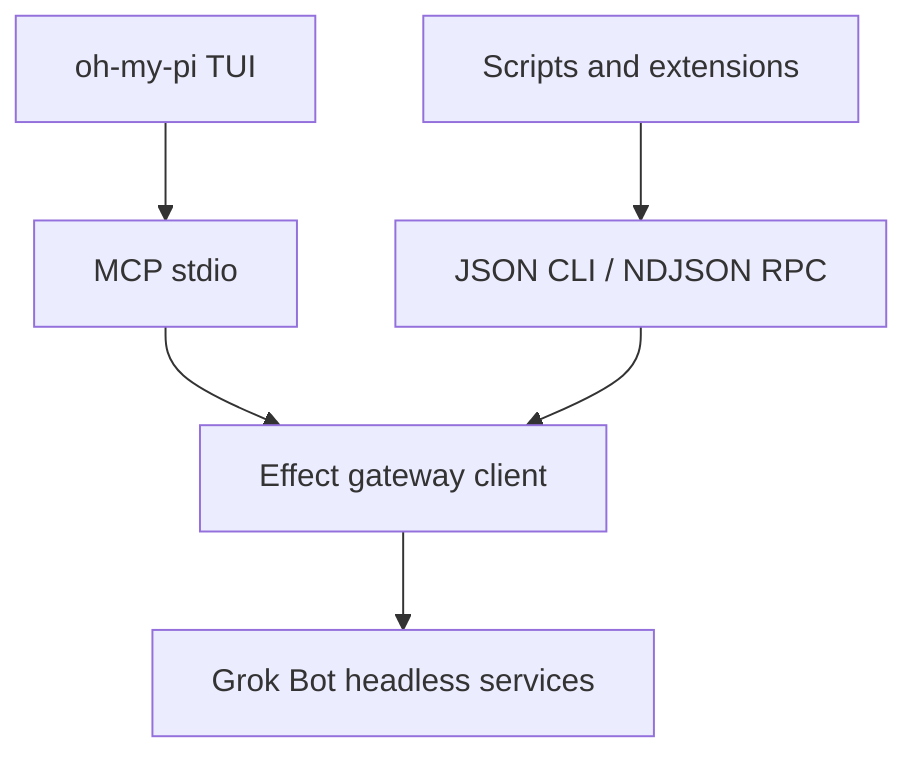

# Effect CLI and oh-my-pi integration

`grok-bot` is a machine-first Effect TypeScript client for the headless Grok
Bot host. It does not import Electron, take the host lock, start a second host,
or kill an existing desktop process. A running Grok Bot publishes an
authenticated HTTP/SSE gateway, and the CLI uses that boundary.



## Build and run

The repository requires Node.js 26.5 or newer within the Node 26 line
(`>=26.5.0 <27`). Install the pinned dependencies and build the launcher:

```sh
npm ci
npm run cli:build
./dist/cli/grok-bot.mjs --help
```

The executable and MCP `serverInfo` currently report CLI version `0.1.0`.
That protocol/client version is intentionally independent of this repository's
application package version (`0.18.0-reconstructed.1`) and the stock `0.30.0`
surface audited for catalog compatibility.

`npm link` can install the `grok-bot` bin locally after the build:

```sh
npm link
grok-bot doctor
```

Global options belong before the subcommand:

```sh
grok-bot --output pretty services
grok-bot --timeout-ms 120000 agent list
```

The default request timeout is 90 seconds. This intentionally exceeds Grok
Bot 0.30's 75-second transcription coordinator deadline; lower it explicitly
for callers that prefer a shorter failure bound.

## Connection and discovery

By default the CLI checks current, production, development, and lab discovery
locations, including `~/.grokbot/gateway.json`. It probes `/health` and matches
both `pid` and `startedAt` before trusting a discovery record, so a stale file
or reused port is not silently selected.

Precedence is:

1. `--url` and `--token`;
2. `GROK_BOT_GATEWAY_URL` / `GROK_BOT_GATEWAY_TOKEN`;
3. `SAND_HOST_GATEWAY_URL` / `SAND_HOST_GATEWAY_TOKEN`;
4. `--discovery` or `GROK_BOT_GATEWAY_DISCOVERY`;
5. automatic discovery files.

Tokens read from discovery or environment are used only in the Authorization
header. `doctor`, `grok.connection`, errors, and service results do not echo the
token. The reconstructed host always requires a bearer token, including on
loopback and for `/health`; its own health probes authenticate too. By default
the host generates a fresh random token and writes it only to its discovery
file, which has mode `0600` inside its mode `0700` data directory. Clear-text
HTTP is accepted on loopback only; a non-loopback HTTP URL requires the
conspicuous `--allow-insecure-remote` override. HTTPS is expected for a remote
gateway.

## One-shot commands

After command-line parsing succeeds, a one-shot command writes one terminal
JSON envelope to stdout for either success or a gateway/runtime failure;
diagnostics remain on stderr. A command-line parse failure, such as a missing
required option or malformed integer, intentionally writes plain diagnostics
to stderr, leaves stdout empty, and exits with status 1 so it cannot corrupt a
JSON, NDJSON, or MCP protocol stream.

```sh
grok-bot health
grok-bot doctor
grok-bot services --group mcp
grok-bot describe-service launch-cloud-agent
grok-bot agent list
grok-bot agent create --name Researcher --description "Investigate regressions"
grok-bot chat send AGENT_ID "Inspect the failing test"
grok-bot provider status
grok-bot provider set codex --yes
```

`agent create` requires both `--name` and `--description`; `--title` remains
optional. A missing required option is a command-line parse failure and is not
sent to the gateway.

Every compiled service is callable by camelCase or kebab-case name:

```sh
grok-bot service get-host-status
grok-bot service launch-cloud-agent --json '{"prompt":"Fix the build"}' --yes
printf '%s\n' '{"id":"agent-1"}' | grok-bot service get-agent-memories --stdin
grok-bot call futureMethod --allow-unknown --json '{}'
```

JSON input is consumed only when `--json`, `--file`, or `--stdin` is explicit.
This prevents a parent process with an inherited non-TTY stdin from causing a
one-shot command to hang. `--file` accepts a non-symlink regular file of at
most 64 MiB and reads it through one validated descriptor, so FIFOs, devices,
and path-swap growth cannot block or bypass the bound. Known destructive
operations fail before dispatch unless `--yes` is present:

```sh
grok-bot service delete-agents --json '{"ids":["agent-1"]}' --yes
grok-bot prepare-upgrade --yes
```

`provider set` changes shared host settings and therefore also requires
`--yes`, as shown above. The generic `service` and `call` surfaces also classify
`generateAgentAvatarImage`, `launchCloudAgent`, and `installMcpPlugin` as
destructive and require `--yes` before dispatching them.

`avatar --out PATH` refuses to replace an existing file unless `--force` is
also present.

### Attachment files

Use the specialized file command for attachments, especially video that is too
large for a JSON protocol frame:

```sh
grok-bot attachment upload ./notes.pdf --agent-id AGENT_ID
grok-bot --timeout-ms 600000 attachment upload ./demo.mp4 \
  --filename demo.mp4 --agent-id AGENT_ID
```

The source must be a nonempty regular file. `--filename` defaults to the local
basename and determines the media limit: ordinary files may be at most 25 MiB;
`.m4v`, `.mov`, `.mp4`, `.ogv`, and `.webm` files may be at most 200 MiB.
`--agent-id` is optional only when the host has an active fallback agent, so an
integration should normally pass it explicitly. Raise the global timeout for a
large upload as in the second example.

The client reads in 64 KiB chunks and negotiates the upload transport from the
live gateway capabilities. A reconstructed host advertising
`attachmentUploadStreamV1` receives an authenticated `application/octet-stream`
request at `/api/uploadAttachmentStream` with an exact positive
`Content-Length`; the host enforces the filename-based byte limit and accepts
at most two raw attachment streams concurrently. It stages mode-`0600`
temporary content, atomically finalizes content-addressed storage, and cleans
up a cancelled or incomplete upload. A host without that reconstructed
extension, including stock 0.30, receives an
incremental canonical base64 JSON `uploadAttachment` request instead. Neither
path retains a complete base64 copy in the CLI, but the fallback still expands
the wire body and is subject to the target's JSON request limit. This
reconstructed gateway caps JSON request bodies at 64 MiB, so full 200 MiB video
support requires a raw-capable reconstructed host.

MCP keeps its configurable 64 MiB hard frame ceiling, while NDJSON RPC frames
remain fixed at 40 MiB. Catalog schema validation applies to both; neither can
carry the full 200 MiB video envelope. Use
`attachment upload` against a raw-capable reconstructed host for that case.

`chat send` stamps a UUID `clientNonce` and returns it with an
`acceptance-only` marker. HTTP acceptance is not turn completion. Observe the
`agents` and `transcript` channels, or read the transcript, before treating a
turn as finished.

## Events

Events are NDJSON even when one-shot output is configured as pretty JSON:

```sh
grok-bot events transcript agents agent-activity
grok-bot events --count 10 workflows automations
```

The client reconnects retryable SSE failures. The upstream stream has no event
IDs or replay cursor, so a reconnect emits the synthetic `grok.gateway` channel
with `{ "kind": "reconnected", "possibleGap": true }`. Consumers must refresh
their relevant snapshot after that frame.

The catalog covers the raw gateway channels from the reconstructed host and
public 0.30 build, including `transcript`, `agents`, `agent-upserted`,
`agent-activity`, `workflows`, `automations`, `subagents`, `async-tasks`,
`outline`, `memory`, `mcp-servers`, `mcp-auth`, `sharing`, `host-settings`,
`auth-status`, `local-tool-permission`, `tray`, `forever-box`,
`box-disk-pressure`, `teach-recording`, and `computer-action`.

## oh-my-pi through MCP

oh-my-pi natively discovers project MCP configuration at `.omp/mcp.json` and
user configuration at `~/.omp/agent/mcp.json`. After `npm link`, a project
configuration can be:

```json
{
  "$schema": "https://raw.githubusercontent.com/can1357/oh-my-pi/main/packages/coding-agent/src/config/mcp-schema.json",
  "mcpServers": {
    "grok-bot": {
      "type": "stdio",
      "command": "grok-bot",
      "args": ["mcp", "--stdio"],
      "requestIdFormat": "string",
      "timeout": 120000
    }
  }
}
```

Without `npm link`, use an absolute launcher path:

```json
{
  "mcpServers": {
    "grok-bot": {
      "type": "stdio",
      "command": "node",
      "args": [
        "/absolute/path/to/grok-bot-0.18-reconstructed/dist/cli/grok-bot.mjs",
        "mcp",
        "--stdio"
      ],
      "requestIdFormat": "string",
      "timeout": 120000
    }
  }
}
```

Then use `/mcp reload`, `/mcp list`, and `/mcp test grok-bot` in oh-my-pi.
Review project MCP files before running them: stdio entries execute local
commands. MCP always uses JSON-RPC over stdio; `--stdio` is retained as an
explicit compatibility flag for integrations and does not select another
transport.

The MCP projection is read-only by default and filters its tool list to methods
advertised by a host that supports live discovery. Privacy-sensitive reads,
including transcript/thread, search/media/avatar, private audio, and Cloud
Agent artifact data, are also absent by default. Additional exposure is
explicit:

| Flag | Additional tools |
|---|---|
| `--include-writes` | Non-destructive mutations and interactive responses |
| `--include-destructive` | Destructive/lifecycle operations |
| `--include-sensitive` | Credentials, host paths, private audio/transcripts, search/media/avatar data, Cloud Agent prompts/images/artifacts, and other sensitive fields within enabled risk classes |
| `--unsafe-human-actions` | Approvals, forms, widgets, room-membership changes, voice nudges, secrets, and other user decisions; requires all three `--include-*` flags |
| `--unsafe-raw` | Generic raw gateway tool |
| `--allow-unknown-raw` | Unknown names through the raw tool; requires `--unsafe-raw` |

Without `--include-sensitive`, MCP failure projection removes `ErrorBody.path`
and replaces every gateway/runtime failure message with fixed code-specific
text. Non-secret routing metadata such as code, status, retryability, method,
and line remain; the sensitive gate retains the full failure body for a trusted
operator.

Human-decision services stay hidden even when ordinary writes are enabled;
`--unsafe-human-actions` is a separate boundary because an MCP agent must not
silently approve its own local command or impersonate a form/widget decision.
The server rejects an incomplete `--unsafe-human-actions` combination or
`--allow-unknown-raw` without `--unsafe-raw` at startup. Risk classes remain
independent otherwise: for example, `--include-sensitive` does not itself
enable writes or destructive calls. `sendPrompt` is available with
`--include-writes`, but attachment path/name fields are omitted and rejected
until `--include-sensitive` is also present. Cloud Agent launches require both
`--include-destructive` and `--include-sensitive`; MCP-account logout likewise
crosses both boundaries. Billable `generateAgentAvatarImage`, when advertised
by the target host, also requires the destructive and sensitive gates.
`createSharedRoom`, `addOwnAgentToSharedRoom`,
`removeOwnAgentFromSharedRoom`, `leaveSharedRoom`, and `nudgeVoiceCall` are
among the operations that additionally require `--unsafe-human-actions` and
therefore all three `--include-*` flags.

Do not put exposure flags in a shared project config unless every user and the
target gateway are trusted. oh-my-pi can abort some stdio MCP calls locally
without sending cancellation to the server. EOF and process interruption still
cancel this server's scoped client fibers. NDJSON RPC additionally exposes
per-request client-transport cancellation, but a host operation stops only if
that implementation cooperates with abort; cancellation never proves that
remote work or a mutation was rolled back.

Three services are never projected as named MCP tools, regardless of the flags
above. `executeRoutedMcpTool`, `refreshMcp`, and `setHostSettings` are legacy or
open-ended multiplexers whose request body can cross several safety classes.
They remain reachable from the one-shot/NDJSON interfaces; inside MCP,
reaching them requires the conspicuous `--unsafe-raw` bridge.

The recovered stock 0.30 watch implementation can block for up to five hours.
This reconstructed host deliberately defines its `watchCloudAgent`
compatibility route as one bounded, nonblocking status snapshot with
terminal/run-status metadata. It is available as a named MCP read with
`--include-sensitive`; clients can call it again or use `getCloudAgent` when
they want later status.

Cloud Agent launch and follow-up writes recheck the cached team-admin policy
before contacting the backend. Each request accepts at most 8 PNG, JPEG, WebP,
or GIF images and at most 25 MiB of decoded image data in aggregate.
`getCloudAgentTranscript` returns complete-line JSONL bounded to 2,000 lines
and 2 MiB, plus `lineCount`, `totalLineCount`, `byteCount`, `truncated`, and
`limits` metadata; credential-like field names are redacted before the gateway
response leaves the host.

MCP input is byte-framed before JSON parsing. Input messages and output
responses each default to a 40 MiB limit, enough for 25 MiB of binary media
after base64 expansion and JSON framing. `--max-message-bytes N` accepts a
positive safe integer through 64 MiB (67,108,864 bytes).
`--max-output-message-bytes N` accepts 2,048 through 67,108,864 bytes. Output
wire-frame accounting includes the terminating LF. Invalid UTF-8 is rejected,
oversized input lines are discarded through their newline, and oversized
results become a bounded protocol error.

Active requests may retain at most 64 MiB of input and reserve at most 128 MiB
of results in aggregate. The gateway can materialize a complete 64 MiB JSON
response before MCP applies its wire cap, so each request reserves the larger
of that gateway cap and its configured output cap before dispatch. Every
supported output cap therefore admits at most two concurrent requests. An
independent count ceiling of 64 remains, but the result budget is tighter. MCP
initialize advertises the effective values, including
`maxGatewayResponseBytes`, under
`capabilities.experimental.grokBotTransportLimits`. JSON-RPC string IDs are
limited to 256 UTF-8 bytes and the session remembers at most 100,000 IDs.

The server announces dynamic tool lists. Each `tools/list` re-negotiates the
live gateway manifest through a one-second coalescing cache, and after the
first list it runs one scoped five-second refresh loop. A background refresh or
named tool call that observes a changed projected tool set emits
`notifications/tools/list_changed` without requiring a removed service to fail
with 404 first; a `tools/list` response publishes its own newly observed list
without a redundant preceding notification. Overlapping refreshes share one
request, typed failures use the same short anti-stampede cache, and EOF or
cancellation remains interruptible. Discovery itself has a 256 KiB response
cap, a 10-second maximum deadline, at most 1,024 valid method names, and at most
256 bounded capability names. A transient refresh failure retains the
session's last known tool projection (or the audited stable 0.30 set before the
first successful negotiation), while a gateway that does not implement
discovery still uses the stock 0.30 fallback. Image-returning
`readAttachmentImage`, `getAgentAvatar`, and
`getMcpPluginLogo` calls use native MCP image content; their accompanying text
and structured content retain only bounded MIME, byte-count, dimension, or
version metadata instead of duplicating the base64 data URL.

The server negotiates the initialize-based MCP revisions used by current and
older oh-my-pi releases. The oh-my-pi examples use a 120-second client timeout,
leaving headroom beyond the CLI's 90-second gateway timeout and Grok Bot's
75-second transcription coordinator deadline.

## Persistent NDJSON RPC

`grok-bot rpc --stdio` is intended for an oh-my-pi extension or another custom
TUI bridge that needs subscriptions and per-request client-transport
cancellation. Every line must carry the protocol and a session-unique string
ID:

```json
{"protocol":"grok-effect-cli/v1","protocolVersion":1,"type":"request","id":"req-1","method":"grok.health"}
{"protocol":"grok-effect-cli/v1","protocolVersion":1,"type":"request","id":"sub-1","method":"grok.subscribe","params":{"channels":["transcript","agents"]}}
{"protocol":"grok-effect-cli/v1","protocolVersion":1,"type":"cancel","id":"cancel-1","targetId":"req-1"}
{"protocol":"grok-effect-cli/v1","protocolVersion":1,"type":"shutdown","id":"shutdown-1"}
```

RPC likewise always uses NDJSON over stdio; its `--stdio` switch is a
compatibility spelling, not a transport selector.

The ready frame advertises concrete limits. The current contract bounds input
and output frames to 40 MiB each, with the terminating LF included in output
wire-frame accounting. Active requests may retain at most 64 MiB of input and
reserve at most 128 MiB of results in aggregate. The gateway may materialize a
64 MiB JSON response before RPC applies its 40 MiB wire cap, so each request
reserves 64 MiB and the effective active-request limit is two; subscriptions
remain capped at 32. The ready frame exposes `maxGatewayResponseBytes` as well
as the wire and aggregate limits. Each SSE event is limited to
16,777,216 bytes, and active SSE parser buffers may reserve at most 67,108,864
bytes in aggregate. The ready frame exposes those values as
`maxSseEventBytes` and `maxActiveSseBufferBytes`. Buffers begin at 64 KiB and
grow lazily; their reservation remains charged while a parsed event waits for
downstream consumption. Request and subscription IDs are nonempty UTF-8
strings of at most 256 bytes, and a session remembers at most 100,000 unique
IDs.

The input reader grows lazily as bytes arrive, so the 40 MiB ceiling is not
reserved for every connection. These frame limits leave room for the same
25 MiB binary-media services as MCP. Writes are serialized with backpressure.
Cancellation gives the target exactly one `CANCELLED` terminal with
`dispatchState: "unknown"`. It interrupts the client Effect/fetch scope;
generic host command work is not request-abort-aware unless that specific
operation cooperates, and interrupting a POST cannot prove that a remote
mutation was stopped or rolled back.

Built-in request methods are:

- `grok.ping`, `grok.health`, and `grok.connection`;
- `grok.services.list` and `grok.services.describe`;
- `grok.call` for a named gateway service;
- `grok.subscribe` / `grok.unsubscribe`;
- `grok.cancel` and `grok.shutdown`.

`grok.services.list` merges the compiled union descriptors with the current
gateway manifest. Each descriptor carries `advertised: true/false` when live
negotiation succeeds (or `null` when only the static 0.30 fallback is
available), and `liveExtras` reports advertised methods newer than this client.

A known gateway method can also be used directly as the RPC method. Unknown
names require `allowUnknown: true` on that individual request and must still
pass the strict method-name grammar. Unlike the conservative MCP projection,
RPC is a full-authority bridge: a TUI extension must add its own confirmation
policy before dispatching destructive or human-decision services.

## Safety and compatibility boundaries

- The gateway bearer token grants broad authority. Keep the gateway on
  loopback or authenticated TLS and do not forward its discovery file. Every
  reconstructed-host route, including `/health`, requires that token.
- The named MCP projection permanently excludes open-ended legacy
  multiplexers. Raw MCP and full-authority RPC remain explicit trust
  boundaries. The reconstructed Cloud Agent watch is instead a bounded,
  sensitive status snapshot.
- `setBoxSecrets` is replace-all; retrieve status and explicitly confirm the
  intended replacement set before calling it.
- The CLI does not expose decrypted desktop secrets or raw local-exec paths.
- A stock public 0.30 host may not implement the backported
  `listGatewayServices`; the client falls back to its audited static manifest.
- A shipped method can still be account-, team-, experiment-, or entitlement-
  gated. The server's concrete error is authoritative.
- The public 0.30 backend contains internal marketplace administration and
  credential flows. They are inventoried, not projected as default tools.

See [SERVICE_COVERAGE_0.30.md](SERVICE_COVERAGE_0.30.md) for the exact version
delta and the boundary between stock-0.30 reachability, reconstructed-host
adapters, secret-bearing desktop operations, and genuinely missing 0.30
runtime state.
